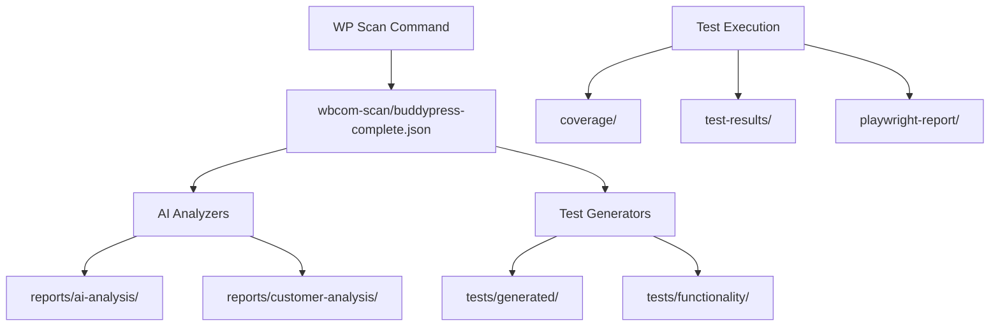

# Test Results and Scan Outputs Locations

## Overview
This document maps where all test results, scan outputs, and generated reports are stored in the wp-testing-framework.

## 1. Scan Outputs
**Location:** `/wp-content/uploads/wbcom-scan/`

### Current Files:
- `buddypress-complete.json` - Main BuddyPress scan data (16KB)
- `plugin-buddypress.json` - Plugin-specific scan data
- `components.json` - BuddyPress components data
- `rest.json` - REST API endpoints data
- `pages.json` - BuddyPress pages data
- `site.json` - Site configuration data
- `activity-types.json` - Activity types data
- `emails.json` - Email templates data
- `nav.json` - Navigation items data
- `settings.json` - Settings data
- `xprofile.json` - Extended profile fields data

## 2. Test Reports
**Location:** `/wp-testing-framework/reports/`

### Structure:
```
reports/
├── ai-analysis/           # AI-generated analysis reports
│   ├── buddypress-ai-actionable-report.md
│   ├── buddypress-ai-decision-matrix.md
│   ├── buddypress-ai-fix-recommendations.md
│   ├── buddypress-ai-implementation-guide.md
│   ├── buddypress-ai-issue-database.md
│   └── buddypress-ai-master-index.md
├── customer-analysis/     # Customer value analysis
│   ├── buddypress-business-case-report.md
│   ├── buddypress-competitor-analysis.md
│   ├── buddypress-customer-value-report.md
│   ├── buddypress-improvement-roadmap.md
│   └── buddypress-user-experience-audit.md
└── buddypress-workflow-report.md
```

## 3. Test Execution Results

### PHPUnit Test Results
**Location:** `/wp-testing-framework/`
- `.phpunit.cache/` - PHPUnit cache (gitignored)
- `coverage/` - Code coverage reports (gitignored)

### E2E Test Results
**Location:** `/wp-testing-framework/tools/e2e/`
- `test-results/` - Playwright test results (gitignored)
- `playwright-report/` - Playwright HTML reports (gitignored)
- `tests/*.spec.ts-snapshots/` - Visual regression snapshots

### Current Snapshots:
```
tools/e2e/tests/pages.spec.ts-snapshots/
├── activity-chromium-darwin.png
├── activity-firefox-darwin.png
├── activity-webkit-darwin.png
├── groups-chromium-darwin.png
├── groups-firefox-darwin.png
├── groups-webkit-darwin.png
├── members-chromium-darwin.png
├── members-firefox-darwin.png
└── members-webkit-darwin.png
```

## 4. Generated Test Files
**Location:** `/wp-testing-framework/tests/`

### Generated Tests:
```
tests/
├── generated/buddypress/
│   ├── BUG-CHECKLIST.md
│   ├── FEATURE-REPORT.md
│   ├── TEST-PLAN.md
│   ├── Unit/PluginTest.php
│   ├── Integration/PluginIntegrationTest.php
│   ├── Security/PluginSecurityTest.php
│   └── e2e/plugin.spec.ts
├── functionality/
│   ├── buddypress-customer-value-analysis.md
│   ├── buddypress-executable-test-plan.md
│   ├── buddypress-functionality-report.md
│   ├── buddypress-functionality-tests.php
│   └── buddypress-user-scenario-tests.md
└── phpunit/Components/
    └── [Component-specific test files]
```

## 5. Log Files
**Location:** Various (all gitignored)
- `workflow.log` - Universal workflow execution log
- `*.log` - Any other log files generated during testing

## 6. Environment Data
**Location:** `/wp-testing-framework/`
- `.env.e2e` - E2E test environment configuration

## Data Flow Summary



## Important Notes

1. **Scan Data**: All plugin scans are stored in `/wp-content/uploads/wbcom-scan/`
2. **Reports**: All analysis reports are in `/wp-testing-framework/reports/`
3. **Test Results**: Execution results are gitignored but stored locally in respective directories
4. **Snapshots**: Visual regression snapshots are committed to track UI changes

## Commands to Check Data

```bash
# View scan data
ls -la ../wp-content/uploads/wbcom-scan/

# View reports
ls -la reports/

# Run coverage report
npm run coverage:report

# View test results after execution
ls -la coverage/
ls -la tools/e2e/test-results/
ls -la tools/e2e/playwright-report/
```

## Cleanup Commands

```bash
# Clean test results
rm -rf coverage/ test-results/ playwright-report/ .phpunit.cache/

# Clean logs
rm -f *.log

# Full cleanup (preserves scan data and reports)
npm run clean
```