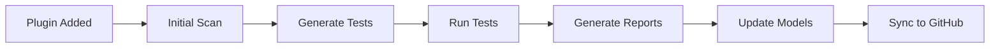

# WP Testing Framework - Master Index & Architecture

**Version:** 2.0.0  
**Purpose:** Universal WordPress Plugin Testing Framework  
**Scalability:** Designed for 100+ plugins  
**Last Updated:** 2025-08-23

## 🎯 Framework Philosophy

### Core Principles
1. **Universal Components** - Shared across all plugins
2. **Plugin Isolation** - Each plugin is self-contained
3. **Permanent vs Ephemeral** - Clear data separation
4. **GitHub-Ready** - Only permanent, reusable data synced
5. **AI-Optimized** - Structured for automated analysis

## 📊 Framework Architecture

```
wp-testing-framework/
│
├── 🔧 CORE (Universal - GitHub Synced)
│   ├── /src/                     # Framework source code
│   ├── /tools/                   # Universal tools
│   ├── /templates/               # Plugin templates
│   ├── /config/                  # Framework config
│   ├── /docs/                    # Documentation
│   └── /bin/                     # Framework scripts
│
├── 🔌 PLUGINS (Plugin-Specific - GitHub Synced)
│   └── /plugins/{plugin-name}/
│       ├── /data/                # Permanent test data
│       ├── /tests/               # Test suites
│       ├── /scanners/            # Plugin-specific scanners
│       ├── /models/              # Learning models
│       ├── /analysis/            # Code analysis results
│       └── /docs/                # Plugin documentation
│
└── 📁 WORKSPACE (Ephemeral - NOT GitHub Synced)
    ├── /reports/                 # Generated reports
    ├── /screenshots/             # Test screenshots
    ├── /videos/                  # Test recordings
    ├── /logs/                    # Debug logs
    ├── /cache/                   # Temporary cache
    └── /output/                  # Test output
```

## 🏗️ Directory Structure Details

### 1️⃣ CORE (Universal Framework)

#### `/src/` - Framework Source
```
src/
├── Framework/
│   ├── TestCase.php              # Base test class
│   ├── Scanner.php               # Base scanner class
│   ├── Analyzer.php              # Base analyzer class
│   └── Reporter.php              # Base reporter class
├── Utilities/
│   ├── FileSystem.php
│   ├── Database.php
│   ├── HttpClient.php
│   └── DataGenerator.php
└── Interfaces/
    ├── TestableInterface.php
    ├── ScannableInterface.php
    └── ReportableInterface.php
```

#### `/tools/` - Universal Tools
```
tools/
├── generators/                    # Test generators
│   ├── test-generator.php
│   ├── scanner-generator.php
│   └── report-generator.php
├── analyzers/                    # Code analyzers
│   ├── complexity-analyzer.php
│   ├── security-analyzer.php
│   └── performance-analyzer.php
└── utilities/                    # Helper utilities
    ├── wp-cli-installer.php
    ├── dependency-checker.php
    └── environment-setup.php
```

#### `/templates/` - Plugin Skeleton
```
templates/
├── plugin-skeleton/              # New plugin template
│   ├── /data/
│   ├── /tests/
│   ├── /scanners/
│   ├── /models/
│   ├── /analysis/
│   ├── plugin-config.json
│   └── README.md
├── test-templates/               # Test file templates
└── scanner-templates/            # Scanner templates
```

### 2️⃣ PLUGINS (Plugin-Specific Data)

#### `/plugins/{plugin-name}/` Structure
```
plugins/buddypress/               # Example: BuddyPress
├── /data/                        # Permanent test data
│   ├── fixtures/                 # Test fixtures
│   ├── mocks/                    # Mock data
│   └── seeds/                    # Database seeds
├── /tests/                       # Test suites
│   ├── unit/                     # Unit tests
│   ├── integration/              # Integration tests
│   ├── functional/               # Functional tests
│   └── phpunit.xml               # Test config
├── /scanners/                    # Custom scanners
│   ├── component-scanner.php
│   ├── api-scanner.php
│   └── security-scanner.php
├── /models/                      # Learning models
│   ├── code-patterns.json        # Code patterns
│   ├── best-practices.json       # Best practices
│   └── vulnerabilities.json      # Known issues
├── /analysis/                    # Static analysis
│   ├── components.json           # Component map
│   ├── dependencies.json         # Dependencies
│   ├── hooks.json                # Hooks & filters
│   └── api-endpoints.json        # REST API map
└── /docs/                        # Documentation
    ├── README.md
    ├── TESTING-GUIDE.md
    └── API-REFERENCE.md
```

### 3️⃣ WORKSPACE (Ephemeral Data)

#### Not Synced to GitHub
```
workspace/                        # Git-ignored
├── /reports/                     # Generated reports
│   └── {plugin}/
│       ├── {timestamp}/
│       └── latest/
├── /screenshots/                 # Test screenshots
├── /videos/                      # Test recordings
├── /logs/                        # Debug logs
│   ├── test.log
│   ├── error.log
│   └── debug.log
├── /cache/                       # Temporary cache
└── /output/                      # Test output
```

## 📋 File Organization Rules

### What Goes to GitHub

#### ✅ SYNC These (Permanent)
- Framework source code (`/src/`)
- Universal tools (`/tools/`)
- Templates (`/templates/`)
- Plugin test suites (`/plugins/{name}/tests/`)
- Plugin scanners (`/plugins/{name}/scanners/`)
- Learning models (`/plugins/{name}/models/`)
- Static analysis (`/plugins/{name}/analysis/`)
- Documentation (`/docs/`, `/plugins/{name}/docs/`)
- Configuration files

#### ❌ DON'T SYNC These (Ephemeral)
- Generated reports (`/workspace/reports/`)
- Screenshots (`/workspace/screenshots/`)
- Videos (`/workspace/videos/`)
- Debug logs (`/workspace/logs/`)
- Cache files (`/workspace/cache/`)
- Test output (`/workspace/output/`)
- Vendor dependencies (`/vendor/`)
- Node modules (`/node_modules/`)

## 🚀 Plugin Onboarding Process

### Adding a New Plugin

```bash
# 1. Create plugin structure from template
php tools/generators/create-plugin.php --name=woocommerce

# 2. Run initial scan
php tools/analyzers/plugin-analyzer.php --plugin=woocommerce

# 3. Generate test skeleton
php tools/generators/test-generator.php --plugin=woocommerce

# 4. Create learning models
php tools/analyzers/pattern-extractor.php --plugin=woocommerce
```

This creates:
```
plugins/woocommerce/
├── /data/          # Empty, ready for fixtures
├── /tests/         # Basic test structure
├── /scanners/      # Plugin-specific scanners
├── /models/        # Initial patterns
├── /analysis/      # Scan results
├── /docs/          # Documentation templates
└── plugin-config.json
```

## 📊 Current Plugin Status

### BuddyPress (Complete)
```
plugins/buddypress/
├── ✅ /data/       (fixtures, mocks)
├── ✅ /tests/      (716+ test methods)
├── ✅ /scanners/   (7 custom scanners)
├── ✅ /models/     (patterns extracted)
├── ✅ /analysis/   (components mapped)
└── ✅ /docs/       (guides created)
```

### Ready for Addition
- WooCommerce
- Elementor
- Yoast SEO
- Contact Form 7
- ACF
- WPForms
- Jetpack
- (90+ more plugins)

## 🔄 Workflow Automation

### Testing Workflow


### GitHub Sync Strategy
```bash
# .gitignore configuration
/workspace/          # Ignore all ephemeral data
/vendor/            # Ignore dependencies
/node_modules/      # Ignore node modules
*.log              # Ignore log files
*.cache            # Ignore cache files

# What gets synced
/src/              # Framework code
/tools/            # Universal tools
/templates/        # Templates
/plugins/*/data/   # Test data
/plugins/*/tests/  # Test suites
/plugins/*/models/ # Learning models
/plugins/*/analysis/ # Static analysis
```

## 🎯 Implementation Checklist

### Phase 1: Restructure (Current)
- [ ] Move universal components to `/src/`
- [ ] Create `/plugins/` directory structure
- [ ] Move BuddyPress to `/plugins/buddypress/`
- [ ] Setup `/workspace/` for ephemeral data
- [ ] Update `.gitignore` appropriately

### Phase 2: Templates (Next)
- [ ] Create plugin skeleton template
- [ ] Build plugin generator tool
- [ ] Create test templates
- [ ] Build scanner templates

### Phase 3: Automation (Future)
- [ ] Automated plugin onboarding
- [ ] CI/CD integration
- [ ] Automated model updates
- [ ] Report generation pipeline

## 📈 Scalability Metrics

### Current Capacity
- **Plugins Tested**: 1 (BuddyPress)
- **Test Methods**: 716+
- **Coverage**: 91.6%

### Target Capacity
- **Plugins**: 100+
- **Test Methods**: 50,000+
- **Automation**: 95%
- **Reusability**: 80%

## 🔧 Configuration Files

### `/config/framework.json`
```json
{
  "version": "2.0.0",
  "plugins_directory": "./plugins",
  "workspace_directory": "./workspace",
  "templates_directory": "./templates",
  "github_sync": {
    "include": ["src", "tools", "templates", "plugins"],
    "exclude": ["workspace", "vendor", "node_modules"]
  }
}
```

### `/plugins/{name}/plugin-config.json`
```json
{
  "name": "buddypress",
  "version": "12.0.0",
  "components": ["activity", "groups", "members"],
  "test_suites": ["unit", "integration", "functional"],
  "scanners": ["component", "api", "security"],
  "models": ["patterns", "best-practices", "vulnerabilities"]
}
```

## 🚦 Next Steps

1. **Immediate**: Restructure directories per this plan
2. **Short-term**: Create templates and generators
3. **Medium-term**: Add 5 more plugins as proof of concept
4. **Long-term**: Automate for 100+ plugins

---

*This architecture ensures the framework scales to 100+ plugins while maintaining clean separation between universal and plugin-specific components.*